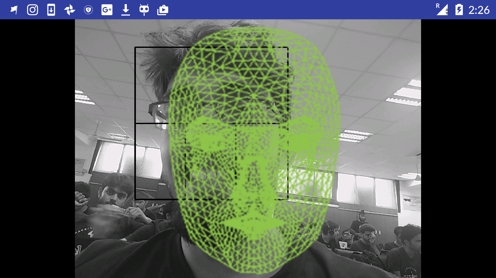
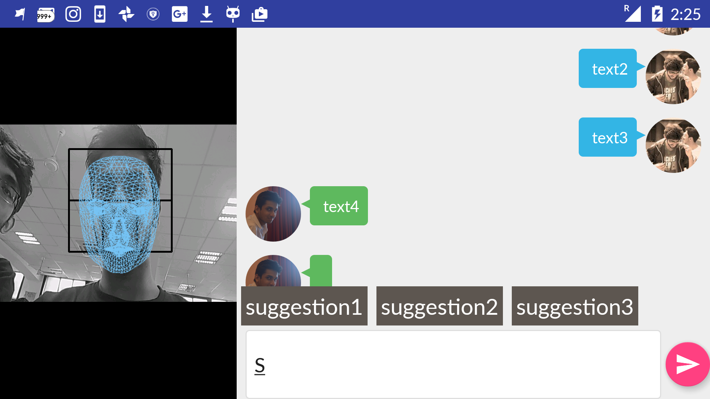

# MiddleMan
Team - **Triad**

Members - *Sarthak Ahuja and Danish Goel*

Submission for **Hack InOut 2016**

Closest Track - *"Build your Bot with Advance Al engine"*

## Idea
While we saw most of the participants had jumped into coding chat bots usig standard APIs, we took this hackathon as an opportunity to experiment and hack into something new a bot could possibly do, besides just finding keywords in your questions to come up with answers. We realized that instead of just reading our text, **could the bot possible read our face as well**? 

The idea we came up with was . We call it middleman as it aids the communication you have by acting as middle filter. 
!
This lead us to finding some interesting use-cases of a bot which could **see us text** and possibly make some of it's own decisions a tad bit smarter - 

 - One usecase would be more meaning text predictions
 - Another possible usecase of a seeing bot could be managing possible text conflicts. Example - 
 - It could also be use for collaborative decisions between two people involved in a chat to provide a gentle nudge, a more human communication of what the other person is feeling while reading yor texts in order to modify your responses without a direct communication with any of the parties. A true middleman indeed.

While the idea was just an idea in this hackathon and we had a whole bunch of incentives to use some sponsor APIs, we went with experimenting with the first use case for this hackathon as it's implementation would give us answers for possible explorations in the later usecases and would be a good se of the limited time we had. 

## Implementation

Being a text completion bot, the application should be as real-time as possible. While we used a REST API for getting autocomplete words and their sentiments, we did not want to add an overload of having the vision component too being done over REST. APIs such as [4] and [5] though provide some good APIs, they unfortunately are extremely poor to use in this context of sentiment analysis of a person's face in real time. The human face gives tiny micro expression which collectively over a time period decide and we would eventually miss out on a lot of analysis time and data if we went in a REST API for such a task. Hence, we decided to code up a quick algorithm ourselves. While deep learning algorithms and implentations claim for a superior accuracy, they take a huge time to train and the available trained models too run take a while (not real time) to generate an output, not to mention that they make the app bulky. Since we were dealing with a binary case here of classifying a "positive" and "non-positive" user sentiment, we went for a statistical machine learning approach of HAAR cascades to first identify the face and then identify the micro-expression. 

<flow chart>

Given the time constraints we focussed on one micro-expression - **The Human Smile** which we extracted using a thresholding based templating method after isolating the mouth on the face and fittig Hough transform lines. We refer the initial HAAR cascade code from [1] for initial stages, but considerably modify their much significant later part of the algorithm as it failed in our context. The following images show the process of extracting the smile from the face. 

<image>

Since we work in real time on a stream of face images, the output stream is bound to be noisy on which we apply a mean filter for smoother operation.

<flow chart>

After obtaining the sentiment of the user we can move towards using the Haven API's to aid text completion and prune their response based on the user's sentiment using the HOD sentiment analysis API. 

<flow chart>

## Final Product

The following is working snapshot of the application:

## Code/APIs/Dependencies

Our code is an android application where 

 - the vision compenent is coded using *OpenCV3Android SDK*[6]
 - the database management system is *Parse*[7]
 - the NLP APIs are *HOD Text Completion*[2] and *HOD Sentiment Analysis*[3]

## Future Work and Challenges

 - An important thing to take care while implementing this bot was that it was supposed to **Real Time**. While our text completion API too was a REST API, we would have idealy have it to be on our device itself for future work in order to support a real time operation.
 - Forced landscape view. Even though texting is more predominantly done in the portrait setup, we work with landscape mode in order to support both views at the moment. The camera view can be completely removed to make the app shift to portrait mode and look just like your every day text messenger.
 - The Face detection and smile tracking algorithm both can be optimized by sufficient training on data collected from the front camera itself. This would greatly improve the performance.
 - We look to explore more usecases on how a seeing chat bot can make more intelligent decisions. :)

## References

 - [1] Smile Mood Meter, MIT ()[]
 - [2] HOD Text Completion API ()[]
 - [3] HOD Sentiment Analysis API ()[]
 - [4] Google Cloud Vision ()[]
 - [5] Helix, PreCog Research Group ()[]
 - [6] OpenCV ()[]
 - [7] Parse ()[]
